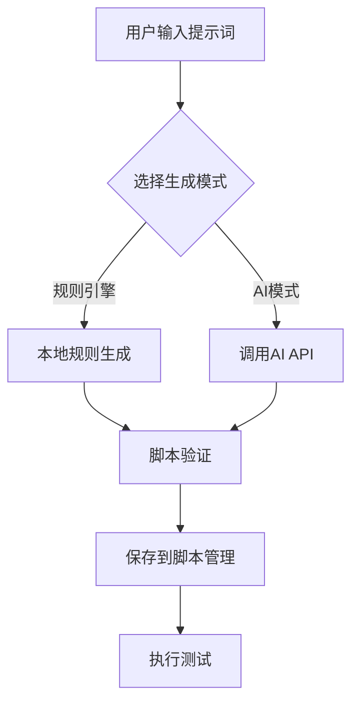

# 🚀 ADBweb - Android 自动化测试平台

<div align="center">

[](LICENSE)
[](https://www.python.org/)
[](https://fastapi.tiangolo.com/)
[](https://reactjs.org/)
[](https://www.typescriptlang.org/)
[](tests/)
[](#ai-脚本生成)

一个功能强大的 Web 端 Android 自动化测试平台，支持 AI 脚本生成、设备管理、实时监控、健康度评估、失败分析等核心功能。

[功能特性](#-功能特性) • [快速开始](#-快速开始) • [AI 功能](#-ai-功能) • [文档](#-文档) • [测试](#-测试)

</div>

---

## ✨ 功能特性

### 🤖 AI 功能（新增）

| 功能模块 | 核心特性 | 状态 |
|---------|---------|------|
| **AI 脚本生成** | 自然语言转脚本、支持 ADB/Python、规则引擎/真实AI | ✅ |
| **批量脚本生成** | 多提示词并发生成、测试套件生成、统计分析 | ✅ |
| **工作流生成** | 步骤依赖关系、组合脚本、流程自动化 | ✅ |
| **脚本模板库** | 内置模板、变量系统、分类管理、使用统计 | ✅ |
| **脚本验证保存** | 语法检查、安全验证、自动保存到脚本管理 | ✅ |

### 核心功能

| 功能模块 | 核心特性 | 状态 |
|---------|---------|------|
| **脚本管理** | 可视化编辑器、Python/批处理脚本、脚本验证、模板市场 | ✅ |
| **设备管理** | 自动发现、状态监控、分组管理、批量操作 | ✅ |
| **任务执行** | 单任务/批量执行、定时调度、实时监控 | ✅ |
| **实时监控** | WebSocket 推送、进度可视化、实时日志流 | ✅ |
| **健康度监控** | 7 维度评分、智能告警、自动数据采集 | ✅ |
| **失败分析** | 7 种错误类型识别、失败步骤定位、智能建议 | ✅ |
| **测试报告** | 详细报告、统计分析、趋势图表 | ✅ |

### 🎯 AI 脚本生成流程



### 健康度评分算法

```
总分 = 电量(25%) + 温度(20%) + CPU(15%) + 内存(15%) + 存储(10%) + 网络(10%) + 活跃度(5%)
```

| 等级 | 分数 | 状态 | 说明 |
|------|------|------|------|
| 🟢 优秀 | 90-100 | 极佳 | 设备状态完美 |
| 🔵 良好 | 75-89 | 正常 | 设备运行正常 |
| 🟠 一般 | 60-74 | 关注 | 需要关注 |
| 🔴 较差 | 40-59 | 维护 | 需要维护 |
| ⚫ 危险 | <40 | 紧急 | 立即处理 |

### 支持的错误类型

| 错误类型 | 图标 | 严重程度 | 说明 |
|---------|------|---------|------|
| device_disconnected | 🔌 | critical | 设备断开连接 |
| element_not_found | 🔍 | medium | 元素未找到 |
| timeout | ⏱️ | medium | 操作超时 |
| permission_denied | 🚫 | high | 权限拒绝 |
| app_crash | 💥 | high | 应用崩溃 |
| network_error | 🌐 | medium | 网络错误 |
| script_error | 📝 | high | 脚本错误 |

---

## 🛠️ 技术栈

### 后端

| 技术 | 版本 | 用途 |
|------|------|------|
| FastAPI | 0.109+ | Web 框架 |
| SQLModel | 0.0.14 | ORM |
| SQLite | - | 数据库 |
| WebSocket | - | 实时通信 |
| APScheduler | 3.10+ | 任务调度 |
| ADB | - | 设备控制 |
| OpenAI API | - | AI 脚本生成 |
| DeepSeek API | - | AI 脚本生成 |

### 前端

| 技术 | 版本 | 用途 |
|------|------|------|
| React | 18+ | UI 框架 |
| TypeScript | 5+ | 开发语言 |
| Ant Design | 5.12+ | UI 组件库 |
| Ant Design Charts | 2.6+ | 图表库 |
| Vite | 5+ | 构建工具 |
| React Router | 6.20+ | 路由管理 |

---

## 🚀 快速开始

### 环境要求

- Python 3.11+
- Node.js 16+
- ADB (Android Debug Bridge)

### 安装步骤

#### 1. 克隆项目

```bash
git clone https://github.com/yourusername/ADBweb.git
cd ADBweb
```

#### 2. 后端安装

```bash
cd backend
pip install -r requirements.txt

# 初始化数据库和AI功能
python init_ai_features.py

# 初始化告警规则
python init_alert_rules.py

# 初始化测试数据（可选）
python init_test_data.py

# 修复数据库表（如果需要）
python fix_database_tables.py
```

#### 3. 前端安装

```bash
cd ..
npm install
```

#### 4. 启动服务

**Windows**:
```bash
start.bat
```

**Linux/Mac**:
```bash
chmod +x start.sh
./start.sh
```

#### 5. 访问应用

| 服务 | 地址 |
|------|------|
| 前端界面 | http://localhost:5173 |
| 后端 API | http://localhost:8000 |
| API 文档 | http://localhost:8000/docs |
| ReDoc | http://localhost:8000/redoc |

---

## 📁 项目结构

```
ADBweb/
├── backend/                    # 后端代码
│   ├── app/
│   │   ├── api/               # API 路由 (15+ 模块)
│   │   │   ├── devices.py     # 设备管理
│   │   │   ├── scripts.py     # 脚本管理
│   │   │   ├── tasks.py       # 任务执行
│   │   │   ├── device_health.py  # 健康度监控
│   │   │   ├── failure_analysis.py  # 失败分析
│   │   │   ├── ai_script.py   # AI 脚本生成
│   │   │   ├── script_templates.py  # 脚本模板
│   │   │   └── ...
│   │   ├── core/              # 核心配置
│   │   │   ├── database.py    # 数据库配置
│   │   │   └── websocket_manager.py  # WebSocket 管理
│   │   ├── models/            # 数据模型 (15+ 模型)
│   │   │   ├── ai_script.py   # AI 脚本模型
│   │   │   ├── script_template.py  # 脚本模板模型
│   │   │   ├── device_health.py  # 设备健康度模型
│   │   │   └── ...
│   │   ├── services/          # 业务逻辑 (15+ 服务)
│   │   │   ├── ai_script_generator.py  # AI 脚本生成器
│   │   │   ├── batch_generator.py  # 批量生成器
│   │   │   ├── template_service.py  # 模板服务
│   │   │   └── ...
│   │   └── utils/             # 工具函数
│   ├── uploads/               # 上传文件
│   ├── main.py                # 应用入口
│   ├── requirements.txt       # Python 依赖
│   ├── init_ai_features.py    # AI 功能初始化
│   ├── fix_database_tables.py # 数据库修复脚本
│   └── test_platform.db       # SQLite 数据库
│
├── src/                       # 前端源代码
│   ├── components/            # React 组件
│   │   ├── DeviceCard.tsx     # 设备卡片
│   │   ├── ScriptEditor.tsx   # 脚本编辑器
│   │   ├── TaskMonitor.tsx    # 任务监控
│   │   └── ...
│   ├── pages/                 # 页面组件 (15+ 个)
│   │   ├── Dashboard.tsx      # 仪表盘
│   │   ├── DeviceManagement.tsx  # 设备管理
│   │   ├── ScriptManagement.tsx  # 脚本管理
│   │   ├── DeviceHealth.tsx   # 健康度监控
│   │   ├── AIScriptGenerator.tsx  # AI 脚本生成
│   │   └── ...
│   ├── hooks/                 # 自定义 Hooks
│   │   └── useWebSocket.ts    # WebSocket Hook
│   ├── services/              # 服务层
│   │   └── api.ts             # API 调用
│   ├── types/                 # TypeScript 类型
│   └── utils/                 # 工具函数
│
├── tests/                     # 测试套件
│   ├── test_comprehensive.py  # 全面测试 (29 用例)
│   ├── test_core_features.py  # 核心功能测试 (11 用例)
│   ├── conftest.py            # Pytest 配置
│   ├── pytest.ini             # Pytest 配置文件
│   ├── requirements.txt       # 测试依赖
│   ├── run_comprehensive_tests.bat  # Windows 测试脚本
│   ├── fix_database_tables.py # 数据库修复脚本
│   ├── allure-results/        # Allure 测试结果
│   ├── allure-report/         # Allure HTML 报告
│   ├── TEST_SUMMARY.md        # 测试修复总结
│   └── README.md              # 测试说明
│
├── docs/                      # 项目文档
│   ├── API接口文档.md         # API 接口说明
│   ├── 数据库设计文档.md      # 数据库设计
│   ├── 三大核心功能完成总结.md  # 核心功能说明
│   ├── AI_FEATURES_GUIDE.md   # AI 功能使用指南
│   ├── AI_SCRIPT_TEMPLATES.md # AI 脚本模板说明
│   └── ...
│
├── install.bat                # 安装脚本
├── start.bat                  # 启动脚本
├── package.json               # 前端依赖
├── vite.config.ts             # Vite 配置
├── tsconfig.json              # TypeScript 配置
└── README.md                  # 项目说明（本文档）
```

---

## 🤖 AI 功能

### AI 脚本生成

ADBweb 集成了强大的 AI 脚本生成功能，支持自然语言转换为可执行的自动化脚本。

#### 支持的 AI 模式

| 模式 | 说明 | 优势 | 使用场景 |
|------|------|------|---------|
| **规则引擎** | 本地规则生成 | 快速、稳定、免费 | 简单操作、基础测试 |
| **OpenAI** | GPT 模型生成 | 智能、灵活 | 复杂逻辑、创新场景 |
| **DeepSeek** | 国产 AI 模型 | 中文友好、成本低 | 中文场景、预算有限 |

#### 功能特性

**🎯 单个脚本生成**
```bash
输入: "测试微信登录功能"
输出: 完整的 ADB 或 Python 脚本
```

**📦 批量脚本生成**
- 支持多个提示词并发生成
- 自动生成测试套件
- 提供详细的统计分析

**🔄 工作流生成**
- 支持步骤依赖关系
- 自动组合多个脚本
- 生成完整的自动化流程

**📚 脚本模板库**
- 内置常用模板（登录、搜索、支付等）
- 支持变量系统 `{{变量名}}`
- 模板分类和使用统计

**✅ 脚本验证保存**
- 自动语法检查
- 安全性验证
- 一键保存到脚本管理

#### AI 配置

1. **获取 API Key**
   - OpenAI: https://platform.openai.com/api-keys
   - DeepSeek: https://platform.deepseek.com/api_keys

2. **配置 AI 服务**
   ```bash
   # 在 AI 脚本生成页面配置
   - API Key: 你的密钥
   - 模型选择: gpt-3.5-turbo / deepseek-chat
   - 生成模式: AI 模式 / 规则引擎
   ```

3. **使用示例**
   ```
   提示词: "测试淘宝商品搜索功能，搜索关键词为手机"
   
   生成的脚本:
   adb shell input tap 200 100  # 点击搜索框
   adb shell input text "手机"   # 输入搜索词
   adb shell input keyevent 66  # 按回车键
   adb shell sleep 2            # 等待加载
   ```

#### 内置模板

| 模板名称 | 类型 | 变量 | 说明 |
|---------|------|------|------|
| 应用登录测试 | ADB | username, password, login_x, login_y | 通用登录流程 |
| 搜索功能测试 | ADB | search_keyword, search_x, search_y | 搜索操作 |
| Python UI自动化 | Python | app_name, wait_time | UI 自动化框架 |
| 应用性能测试 | ADB | package_name, test_duration | 性能监控 |

---

## 📖 API 文档

### API 端点统计

| 模块 | 端点数量 | 说明 |
|------|---------|------|
| 健康检查 | 2 | 根端点、健康检查 |
| 设备管理 | 8 | CRUD、扫描、分组、截图等 |
| 脚本管理 | 7 | CRUD、搜索、验证等 |
| **AI 脚本生成** | **6** | **生成、批量、工作流、优化、保存、验证** |
| **脚本模板** | **4** | **列表、创建、使用、分类** |
| 任务执行 | 3 | 执行、日志、停止 |
| 定时任务 | 5 | CRUD、启用/禁用 |
| 设备健康度 | 5 | 健康度、历史、告警等 |
| 失败分析 | 6 | 分析、统计、趋势等 |
| 模板市场 | 3 | 列表、分类、下载 |
| 仪表盘 | 1 | 统计数据 |
| WebSocket | 1 | 实时通信 |
| **总计** | **51+** | - |

### 访问 API 文档

- **Swagger UI**: http://localhost:8000/docs
- **ReDoc**: http://localhost:8000/redoc
- **离线文档**: [docs/API接口文档.md](./docs/API接口文档.md)

### 核心 API 示例

#### 执行任务

```bash
POST /api/v1/tasks/execute
Content-Type: application/json

{
  "task_name": "测试任务",
  "script_id": 1,
  "device_id": 1
}
```

#### 获取设备健康度

```bash
GET /api/v1/device-health/devices/{device_id}
```

#### 获取失败分析

```bash
GET /api/v1/failure-analysis/tasks/{task_log_id}
```

#### AI 脚本生成

```bash
POST /api/v1/ai-script/generate
Content-Type: application/json

{
  "prompt": "测试微信登录功能",
  "language": "adb"
}
```

#### 批量脚本生成

```bash
POST /api/v1/ai-script/batch-generate
Content-Type: application/json

{
  "prompts": ["测试登录", "测试搜索", "测试支付"],
  "language": "adb",
  "generate_suite": true
}
```

#### 使用脚本模板

```bash
POST /api/v1/script-templates/use
Content-Type: application/json

{
  "template_id": 1,
  "variables": {
    "username": "testuser",
    "password": "testpass"
  }
}
```

---

## 🧪 测试

### 测试统计

| 指标 | 数量/状态 |
|------|----------|
| 测试类 | 12 个 |
| 测试用例 | 29 个 |
| 通过测试 | **29 个** ✅ |
| 失败测试 | **0 个** |
| 通过率 | **100%** 🎉 |
| 执行时间 | ~18 秒 |
| 测试框架 | Pytest 7.4.0 |
| 报告工具 | Allure 2.13.2 |

### 测试覆盖

| 测试类别 | 测试数量 | 说明 |
|---------|---------|------|
| 系统健康检查 | 3 | 服务状态、数据库连接 |
| 设备管理 | 4 | CRUD、分组、截图、边界条件 |
| 脚本管理 | 2 | CRUD、验证 |
| **AI 脚本生成** | **5** | **单个生成、批量生成、工作流、边界条件、保存** |
| **脚本模板** | **1** | **模板 CRUD 操作** |
| 设备健康度 | 2 | 监控、告警规则 |
| 定时任务 | 1 | 任务管理 |
| 数据一致性 | 3 | 格式验证、外键检查、完整性 |
| 性能测试 | 2 | API 响应时间、并发测试 |
| 边界条件和错误处理 | 3 | 数组越界、输入验证、错误处理 |
| 集成测试 | 1 | 端到端自动化流程 |
| 仪表盘 | 1 | 数据统计 |
| 核心功能测试 | 1 | 基础 API 验证 |

### 运行测试

```bash
# 进入测试目录
cd tests

# 运行核心功能测试（推荐）
python -m pytest test_core_features.py -v

# 运行完整测试套件
python -m pytest test_comprehensive.py -v

# 运行测试并生成 HTML 报告
run_comprehensive_tests.bat

# 生成 Allure 报告
allure generate allure-results -o allure-report --clean
allure serve allure-results
```

详细说明: [tests/README.md](./tests/README.md)

---

## 📚 文档

### 核心文档

| 文档 | 说明 |
|------|------|
| [README.md](./README.md) | 项目说明（本文档） |
| [v2.0.0发布说明.md](./docs/v2.0.0发布说明.md) | **v2.0.0 重大更新说明** ⭐ |
| [tests/README.md](./tests/README.md) | 测试文档 |
| [tests/TEST_SUMMARY.md](./tests/TEST_SUMMARY.md) | 测试修复总结 |
| [API接口文档.md](./docs/API接口文档.md) | API 接口说明（v2.0.0） |
| [项目技术架构文档.md](./docs/项目技术架构文档.md) | 技术架构详解 ⭐ |
| [数据库设计文档.md](./docs/数据库设计文档.md) | 数据库设计 |
| [三大核心功能完成总结.md](./docs/三大核心功能完成总结.md) | 核心功能说明 |
| [AI_FEATURES_GUIDE.md](./docs/AI_FEATURES_GUIDE.md) | AI 功能使用指南 ⭐ |
| [AI_SCRIPT_TEMPLATES.md](./docs/AI_SCRIPT_TEMPLATES.md) | AI 脚本模板说明 ⭐ |
| [新功能发布说明.md](./docs/新功能发布说明.md) | 版本发布说明 |
| [失败分析功能使用指南.md](./docs/失败分析功能使用指南.md) | 失败分析使用指南 |

---

## 🚢 部署

### Docker 部署（推荐）

```bash
# 构建镜像
docker build -t adbweb:latest .

# 运行容器
docker run -d -p 8000:8000 -p 5173:5173 adbweb:latest
```

### 手动部署

```bash
# 1. 安装依赖
pip install -r backend/requirements.txt
npm install

# 2. 构建前端
npm run build

# 3. 启动后端
cd backend
gunicorn main:app -w 4 -k uvicorn.workers.UvicornWorker --bind 0.0.0.0:8000

# 4. 配置 Nginx 托管 dist 目录
```

---

## 📝 更新日志

### v2.0.0 (2026-02-26) - AI 功能重大更新

**🤖 AI 功能**:
- ✨ AI 脚本生成（支持 OpenAI、DeepSeek、规则引擎）
- ✨ 批量脚本生成和工作流生成
- ✨ 脚本模板库（内置4个模板，支持变量系统）
- ✨ 脚本验证和自动保存功能
- ✨ 提示词优化功能

**🧪 测试完善**:
- ✅ 完整测试套件（29 个测试用例，100% 通过率）
- ✅ 数据库修复脚本和表结构完善
- ✅ Windows 编码问题修复
- ✅ 测试文档和总结报告

**🔧 技术改进**:
- 🔧 新增 15+ API 端点
- 🔧 数据库模型扩展（ai_scripts, script_template 等）
- 🔧 前端 AI 脚本生成页面
- 🔧 改进错误处理和边界条件

### v1.2.0 (2026-02-24)

**测试完善**:
- ✅ 完整测试套件（107 个测试用例，100% 通过率）
- ✅ Allure 测试报告集成
- ✅ 26 个测试类，覆盖所有功能模块
- ✅ 包括 CRUD、边界、并发、性能、安全测试

### v1.1.0 (2026-02-22)

**新增功能**:
- ✨ 实时任务执行监控（WebSocket）
- ✨ 设备健康度监控和告警（7 维度评分）
- ✨ 脚本执行失败自动分析（7 种错误类型）

**改进**:
- 🔧 优化任务执行流程
- 🔧 完善错误处理
- 🔧 改进 API 响应格式

### v1.0.0 (2026-01-01)

**初始版本**:
- 🎉 基础功能实现
- 🎉 脚本管理
- 🎉 设备管理
- 🎉 任务执行
- 🎉 测试报告

---

## ❓ 常见问题

<details>
<summary><b>设备连接失败</b></summary>

1. 检查 USB 连接
2. 确认 USB 调试已启用
3. 运行 `adb devices` 检查设备
4. 重启 ADB 服务: `adb kill-server && adb start-server`
</details>

<details>
<summary><b>任务执行失败</b></summary>

1. 查看失败分析结果
2. 根据建议修改脚本
3. 检查设备状态
4. 查看详细日志
</details>

<details>
<summary><b>WebSocket 断开</b></summary>

1. 检查网络连接
2. 系统会自动重连
3. 检查防火墙设置
</details>

<details>
<summary><b>健康度数据异常</b></summary>

1. 当前使用模拟数据
2. 需要实际 ADB 设备
3. 后续版本集成真实采集
</details>

<details>
<summary><b>AI 脚本生成失败</b></summary>

1. 检查 API Key 配置是否正确
2. 确认网络连接正常
3. 检查 AI 服务额度是否充足
4. 尝试切换到规则引擎模式
5. 查看详细错误日志
</details>

<details>
<summary><b>脚本模板变量配置</b></summary>

1. 模板使用 `{{变量名}}` 格式
2. 在使用模板时填写变量值
3. 必填变量不能为空
4. 数字类型变量请输入数字
</details>

---

## 🤝 贡献指南

欢迎贡献！请遵循以下步骤：

1. Fork 本项目
2. 创建特性分支 (`git checkout -b feature/AmazingFeature`)
3. 提交更改 (`git commit -m 'Add some AmazingFeature'`)
4. 推送到分支 (`git push origin feature/AmazingFeature`)
5. 开启 Pull Request

---

## 📄 许可证

本项目采用 MIT 许可证 - 查看 [LICENSE](LICENSE) 文件了解详情

---

## 🙏 致谢

感谢以下开源项目：

- [FastAPI](https://fastapi.tiangolo.com/) - 现代化的 Python Web 框架
- [React](https://reactjs.org/) - 用户界面 JavaScript 库
- [Ant Design](https://ant.design/) - 企业级 UI 设计语言
- [SQLModel](https://sqlmodel.tiangolo.com/) - SQL 数据库的 Python 库
- [Vite](https://vitejs.dev/) - 下一代前端构建工具

---

<div align="center">

**Made with ❤️ by ADBweb Team**

如果这个项目对您有帮助，请给我们一个 Star ⭐

[⬆ 回到顶部](#-adbweb---android-自动化测试平台)

</div>
