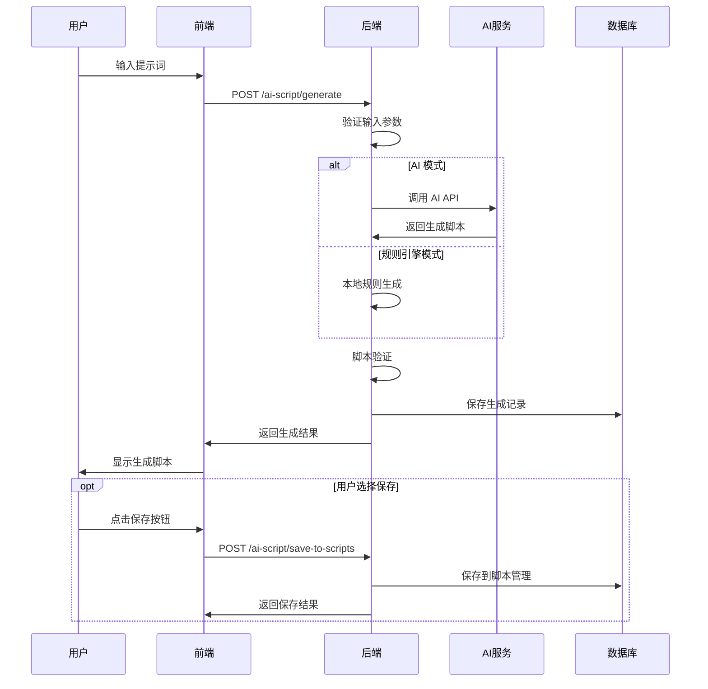
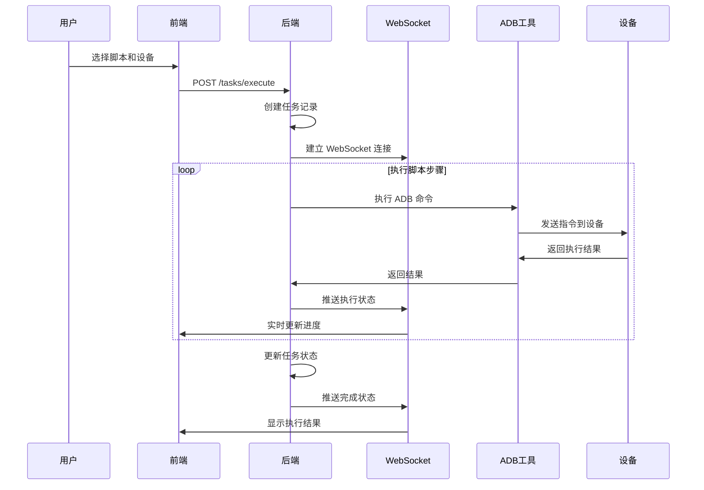
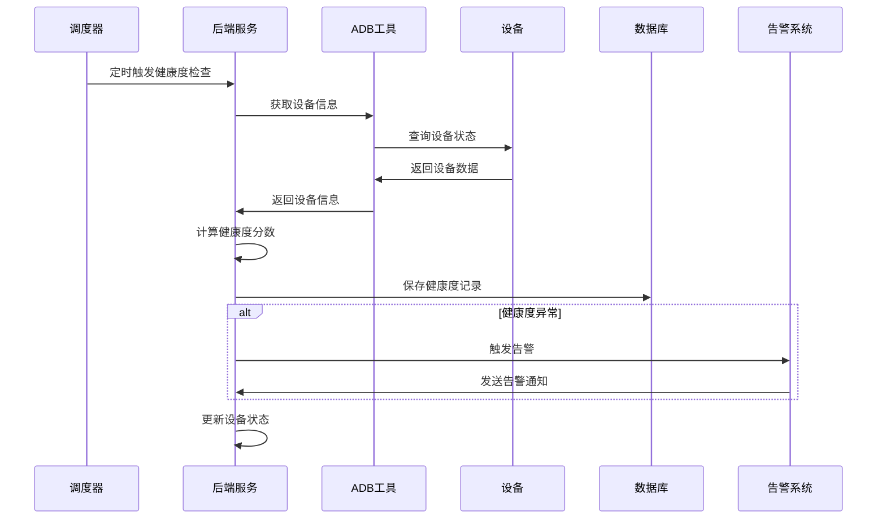

# ADBweb 项目技术架构文档

## 📋 文档信息

| 项目名称 | ADBweb - Android 自动化测试平台 |
|---------|--------------------------------|
| 文档版本 | v2.0.0 |
| 更新时间 | 2026-02-26 |
| 文档类型 | 技术架构文档 |

---

## 🏗️ 系统架构概览

### 整体架构图

```
┌─────────────────────────────────────────────────────────────┐
│                        前端层 (Frontend)                      │
├─────────────────────────────────────────────────────────────┤
│  React 18 + TypeScript + Ant Design + Vite                │
│  ┌─────────────┐ ┌─────────────┐ ┌─────────────┐           │
│  │ 设备管理页面  │ │ 脚本管理页面  │ │ AI脚本生成   │           │
│  └─────────────┘ └─────────────┘ └─────────────┘           │
│  ┌─────────────┐ ┌─────────────┐ ┌─────────────┐           │
│  │ 健康度监控   │ │ 任务执行监控  │ │ 仪表盘统计   │           │
│  └─────────────┘ └─────────────┘ └─────────────┘           │
└─────────────────────────────────────────────────────────────┘
                              │
                         HTTP/WebSocket
                              │
┌─────────────────────────────────────────────────────────────┐
│                        后端层 (Backend)                       │
├─────────────────────────────────────────────────────────────┤
│  FastAPI + SQLModel + WebSocket + APScheduler              │
│  ┌─────────────┐ ┌─────────────┐ ┌─────────────┐           │
│  │   API 层     │ │  WebSocket  │ │  定时任务    │           │
│  │  (15+ 模块)  │ │    管理     │ │    调度     │           │
│  └─────────────┘ └─────────────┘ └─────────────┘           │
│  ┌─────────────┐ ┌─────────────┐ ┌─────────────┐           │
│  │  业务逻辑层   │ │  AI服务层   │ │  数据访问层  │           │
│  │  (15+ 服务)  │ │  (AI生成)   │ │  (ORM)     │           │
│  └─────────────┘ └─────────────┘ └─────────────┘           │
└─────────────────────────────────────────────────────────────┘
                              │
                         数据库连接
                              │
┌─────────────────────────────────────────────────────────────┐
│                        数据层 (Database)                      │
├─────────────────────────────────────────────────────────────┤
│  SQLite + 20+ 数据表                                        │
│  ┌─────────────┐ ┌─────────────┐ ┌─────────────┐           │
│  │  核心业务表  │ │   AI功能表   │ │  监控统计表  │           │
│  │ (设备/脚本)  │ │ (AI脚本/模板)│ │ (健康度/日志)│           │
│  └─────────────┘ └─────────────┘ └─────────────┘           │
└─────────────────────────────────────────────────────────────┘
                              │
                         ADB 连接
                              │
┌─────────────────────────────────────────────────────────────┐
│                        设备层 (Devices)                       │
├─────────────────────────────────────────────────────────────┤
│  Android 设备 + ADB 工具                                     │
│  ┌─────────────┐ ┌─────────────┐ ┌─────────────┐           │
│  │  物理设备    │ │   模拟器     │ │  云端设备    │           │
│  └─────────────┘ └─────────────┘ └─────────────┘           │
└─────────────────────────────────────────────────────────────┘
```

### 外部服务集成

```
┌─────────────────────────────────────────────────────────────┐
│                      外部服务 (External)                      │
├─────────────────────────────────────────────────────────────┤
│  ┌─────────────┐ ┌─────────────┐ ┌─────────────┐           │
│  │  OpenAI API │ │ DeepSeek API│ │  其他AI服务  │           │
│  │  (GPT模型)   │ │  (国产AI)   │ │  (扩展支持)  │           │
│  └─────────────┘ └─────────────┘ └─────────────┘           │
└─────────────────────────────────────────────────────────────┘
                              │
                         HTTP API 调用
                              │
                    ┌─────────────────┐
                    │   AI服务代理层   │
                    │  (统一接口管理)  │
                    └─────────────────┘
```

---

## 🔧 技术栈详解

### 前端技术栈

| 技术 | 版本 | 用途 | 选择理由 |
|------|------|------|---------|
| **React** | 18.2+ | UI 框架 | 组件化开发、生态丰富、性能优秀 |
| **TypeScript** | 5.0+ | 开发语言 | 类型安全、开发效率、代码质量 |
| **Ant Design** | 5.12+ | UI 组件库 | 企业级组件、设计规范、开箱即用 |
| **Ant Design Charts** | 2.6+ | 图表库 | 数据可视化、图表丰富、易于集成 |
| **Vite** | 5.0+ | 构建工具 | 快速构建、热更新、现代化工具链 |
| **React Router** | 6.20+ | 路由管理 | 单页应用路由、嵌套路由支持 |
| **Axios** | 1.6+ | HTTP 客户端 | 请求拦截、响应处理、错误处理 |

### 后端技术栈

| 技术 | 版本 | 用途 | 选择理由 |
|------|------|------|---------|
| **FastAPI** | 0.109+ | Web 框架 | 高性能、自动文档、类型提示 |
| **SQLModel** | 0.0.14 | ORM 框架 | 类型安全、Pydantic 集成 |
| **SQLite** | 3.40+ | 数据库 | 轻量级、无需配置、适合中小型项目 |
| **WebSocket** | - | 实时通信 | 双向通信、实时更新、低延迟 |
| **APScheduler** | 3.10+ | 任务调度 | 定时任务、作业调度、持久化 |
| **Pydantic** | 2.5+ | 数据验证 | 类型验证、序列化、配置管理 |
| **Uvicorn** | 0.25+ | ASGI 服务器 | 高性能、异步支持、生产就绪 |

### AI 服务集成

| 服务 | 模型 | 用途 | 特点 |
|------|------|------|------|
| **OpenAI** | GPT-3.5/4 | 脚本生成 | 智能程度高、英文优秀 |
| **DeepSeek** | DeepSeek-Chat | 脚本生成 | 中文友好、成本较低 |
| **规则引擎** | 本地规则 | 脚本生成 | 快速稳定、无需网络 |

---

## 📊 数据库设计

### 数据库架构

```sql
-- 核心业务表
device              -- 设备信息表
script              -- 脚本信息表
scheduled_task      -- 定时任务表
task_log           -- 任务执行日志表

-- AI 功能表
ai_scripts         -- AI 生成脚本表
script_template    -- 脚本模板表
test_cases         -- 测试用例表

-- 监控统计表
device_health_records  -- 设备健康度记录表
device_usage_stats     -- 设备使用统计表
device_alerts          -- 设备告警表
alert_rules           -- 告警规则表

-- 系统功能表
activity_log      -- 活动日志表
system_config     -- 系统配置表
failure_analysis  -- 失败分析表
template          -- 通用模板表
```

### 核心表结构

#### 设备表 (device)
```sql
CREATE TABLE device (
    id INTEGER PRIMARY KEY,
    serial_number TEXT UNIQUE NOT NULL,
    model TEXT,
    android_version TEXT,
    resolution TEXT,
    status TEXT DEFAULT 'offline',
    group_name TEXT,
    last_seen DATETIME,
    created_at DATETIME DEFAULT CURRENT_TIMESTAMP
);
```

#### AI 脚本表 (ai_scripts)
```sql
CREATE TABLE ai_scripts (
    id INTEGER PRIMARY KEY,
    prompt TEXT NOT NULL,
    language TEXT DEFAULT 'adb',
    generated_script TEXT NOT NULL,
    generation_mode TEXT DEFAULT 'rule_engine',
    ai_model TEXT,
    device_model TEXT,
    created_at DATETIME DEFAULT CURRENT_TIMESTAMP
);
```

#### 脚本模板表 (script_template)
```sql
CREATE TABLE script_template (
    id INTEGER PRIMARY KEY,
    name TEXT NOT NULL,
    category TEXT NOT NULL,
    description TEXT,
    language TEXT DEFAULT 'adb',
    template_content TEXT NOT NULL,
    variables TEXT,  -- JSON 格式
    tags TEXT,
    usage_count INTEGER DEFAULT 0,
    is_builtin BOOLEAN DEFAULT 0,
    created_at DATETIME DEFAULT CURRENT_TIMESTAMP
);
```

---

## 🔄 业务流程

### AI 脚本生成流程



### 任务执行流程



### 设备健康度监控流程



---

## 🚀 部署架构

### 开发环境

```
┌─────────────────────────────────────────┐
│              开发环境                    │
├─────────────────────────────────────────┤
│  前端: npm run dev (Vite Dev Server)    │
│  后端: uvicorn main:app --reload        │
│  数据库: SQLite (本地文件)               │
│  端口: 前端 5173, 后端 8000             │
└─────────────────────────────────────────┘
```

### 生产环境

```
┌─────────────────────────────────────────┐
│              生产环境                    │
├─────────────────────────────────────────┤
│  ┌─────────────┐ ┌─────────────┐        │
│  │    Nginx    │ │   Gunicorn  │        │
│  │  (反向代理)  │ │ (WSGI服务器) │        │
│  │  静态文件    │ │  多进程部署  │        │
│  └─────────────┘ └─────────────┘        │
│  ┌─────────────┐ ┌─────────────┐        │
│  │   SQLite    │ │  文件存储    │        │
│  │  (数据库)   │ │ (上传文件)   │        │
│  └─────────────┘ └─────────────┘        │
└─────────────────────────────────────────┘
```

### Docker 容器化

```dockerfile
# 多阶段构建
FROM node:18-alpine AS frontend-builder
WORKDIR /app
COPY package*.json ./
RUN npm ci
COPY . .
RUN npm run build

FROM python:3.11-slim AS backend
WORKDIR /app
COPY backend/requirements.txt .
RUN pip install -r requirements.txt
COPY backend/ .
COPY --from=frontend-builder /app/dist ./static

EXPOSE 8000
CMD ["uvicorn", "main:app", "--host", "0.0.0.0", "--port", "8000"]
```

---

## 📈 性能优化

### 前端优化

| 优化项 | 实现方案 | 效果 |
|--------|---------|------|
| **代码分割** | React.lazy + Suspense | 减少初始加载时间 |
| **组件缓存** | React.memo + useMemo | 避免不必要的重渲染 |
| **API 缓存** | React Query / SWR | 减少重复请求 |
| **虚拟滚动** | 长列表虚拟化 | 提升大数据渲染性能 |
| **图片优化** | WebP 格式 + 懒加载 | 减少带宽占用 |

### 后端优化

| 优化项 | 实现方案 | 效果 |
|--------|---------|------|
| **异步处理** | FastAPI async/await | 提升并发处理能力 |
| **数据库优化** | 索引优化 + 查询优化 | 提升查询性能 |
| **缓存机制** | 内存缓存 + Redis | 减少数据库压力 |
| **连接池** | 数据库连接池 | 提升连接效率 |
| **压缩传输** | Gzip 压缩 | 减少网络传输 |

### 数据库优化

```sql
-- 关键索引
CREATE INDEX idx_device_serial ON device(serial_number);
CREATE INDEX idx_script_type ON script(type);
CREATE INDEX idx_task_log_created ON task_log(created_at);
CREATE INDEX idx_ai_scripts_created ON ai_scripts(created_at);
CREATE INDEX idx_device_health_device_id ON device_health_records(device_id);

-- 查询优化示例
-- 优化前
SELECT * FROM task_log WHERE device_id = ? ORDER BY created_at DESC;

-- 优化后
SELECT id, task_name, status, created_at 
FROM task_log 
WHERE device_id = ? 
ORDER BY created_at DESC 
LIMIT 50;
```

---

## 🔒 安全架构

### 安全措施

| 安全层面 | 实现方案 | 说明 |
|---------|---------|------|
| **输入验证** | Pydantic 模型验证 | 防止恶意输入 |
| **SQL 注入防护** | ORM 参数化查询 | 防止 SQL 注入攻击 |
| **XSS 防护** | 输入转义 + CSP | 防止跨站脚本攻击 |
| **CORS 配置** | 域名白名单 | 防止跨域攻击 |
| **API 限流** | 请求频率限制 | 防止 DDoS 攻击 |
| **敏感信息** | 环境变量存储 | 保护 API Key 等 |

### API 安全

```python
# 输入验证示例
from pydantic import BaseModel, validator

class AIScriptRequest(BaseModel):
    prompt: str
    language: str = "adb"
    
    @validator('prompt')
    def validate_prompt(cls, v):
        if not v or len(v.strip()) == 0:
            raise ValueError('提示词不能为空')
        if len(v) > 1000:
            raise ValueError('提示词长度不能超过1000字符')
        return v.strip()
    
    @validator('language')
    def validate_language(cls, v):
        if v not in ['adb', 'python']:
            raise ValueError('不支持的脚本语言')
        return v
```

---

## 📊 监控与日志

### 监控指标

| 指标类型 | 监控项 | 阈值 |
|---------|--------|------|
| **系统指标** | CPU 使用率 | < 80% |
| **系统指标** | 内存使用率 | < 85% |
| **系统指标** | 磁盘使用率 | < 90% |
| **应用指标** | API 响应时间 | < 2s |
| **应用指标** | 错误率 | < 5% |
| **业务指标** | 任务成功率 | > 95% |
| **业务指标** | 设备在线率 | > 90% |

### 日志架构

```python
# 日志配置示例
import logging
from logging.handlers import RotatingFileHandler

# 配置日志格式
formatter = logging.Formatter(
    '%(asctime)s - %(name)s - %(levelname)s - %(message)s'
)

# 文件日志
file_handler = RotatingFileHandler(
    'logs/adbweb.log', 
    maxBytes=10*1024*1024,  # 10MB
    backupCount=5
)
file_handler.setFormatter(formatter)

# 控制台日志
console_handler = logging.StreamHandler()
console_handler.setFormatter(formatter)

# 配置根日志器
logging.basicConfig(
    level=logging.INFO,
    handlers=[file_handler, console_handler]
)
```

---

## 🔄 扩展性设计

### 水平扩展

```
┌─────────────────────────────────────────┐
│              负载均衡器                  │
├─────────────────────────────────────────┤
│  ┌─────────────┐ ┌─────────────┐        │
│  │  应用实例1   │ │  应用实例2   │        │
│  └─────────────┘ └─────────────┘        │
│  ┌─────────────┐ ┌─────────────┐        │
│  │  应用实例3   │ │  应用实例4   │        │
│  └─────────────┘ └─────────────┘        │
└─────────────────────────────────────────┘
                    │
            ┌─────────────────┐
            │   共享数据库     │
            └─────────────────┘
```

### 微服务架构演进

```
当前单体架构 → 微服务架构

┌─────────────────┐    ┌─────────────────┐
│   单体应用       │    │  API 网关        │
│  ┌───────────┐  │    └─────────────────┘
│  │ 设备管理   │  │              │
│  │ 脚本管理   │  │    ┌─────────────────┐
│  │ AI 生成   │  │    │  设备管理服务    │
│  │ 任务执行   │  │    └─────────────────┘
│  │ 健康监控   │  │    ┌─────────────────┐
│  └───────────┘  │    │  脚本管理服务    │
└─────────────────┘    └─────────────────┘
                      ┌─────────────────┐
                      │  AI 生成服务     │
                      └─────────────────┘
                      ┌─────────────────┐
                      │  任务执行服务    │
                      └─────────────────┘
```

---

## 📚 开发规范

### 代码规范

#### 前端规范
```typescript
// 组件命名：PascalCase
export const DeviceCard: React.FC<DeviceCardProps> = ({ device }) => {
  // Hook 使用
  const [loading, setLoading] = useState(false);
  
  // 事件处理函数：handle + 动作
  const handleDeviceClick = useCallback(() => {
    // 实现逻辑
  }, []);
  
  return (
    <Card>
      {/* JSX 内容 */}
    </Card>
  );
};
```

#### 后端规范
```python
# 文件命名：snake_case
# 类命名：PascalCase
class AIScriptGenerator:
    """AI 脚本生成器"""
    
    def __init__(self, config: AIConfig):
        self.config = config
    
    async def generate_script(
        self, 
        prompt: str, 
        language: str = "adb"
    ) -> AIScriptResult:
        """生成脚本
        
        Args:
            prompt: 用户提示词
            language: 脚本语言
            
        Returns:
            生成结果
        """
        # 实现逻辑
        pass
```

### API 设计规范

```python
# RESTful API 设计
GET    /api/v1/devices           # 获取设备列表
POST   /api/v1/devices           # 创建设备
GET    /api/v1/devices/{id}      # 获取设备详情
PUT    /api/v1/devices/{id}      # 更新设备
DELETE /api/v1/devices/{id}      # 删除设备

# 响应格式统一
{
    "code": 200,
    "message": "success",
    "data": {
        // 具体数据
    }
}
```

---

## 🔮 技术演进规划

### 短期规划 (3-6个月)

| 功能 | 优先级 | 说明 |
|------|--------|------|
| **Redis 缓存** | 高 | 提升性能，减少数据库压力 |
| **用户认证** | 高 | 多用户支持，权限管理 |
| **API 限流** | 中 | 防止滥用，提升稳定性 |
| **日志分析** | 中 | ELK 栈集成，日志可视化 |
| **移动端适配** | 低 | 响应式设计优化 |

### 中期规划 (6-12个月)

| 功能 | 优先级 | 说明 |
|------|--------|------|
| **微服务拆分** | 高 | 服务解耦，独立部署 |
| **消息队列** | 高 | 异步处理，削峰填谷 |
| **分布式存储** | 中 | 数据分片，水平扩展 |
| **AI 模型优化** | 中 | 自训练模型，提升效果 |
| **多云部署** | 低 | 云原生架构，弹性伸缩 |

### 长期规划 (1-2年)

| 功能 | 优先级 | 说明 |
|------|--------|------|
| **边缘计算** | 中 | 设备端智能，降低延迟 |
| **区块链集成** | 低 | 测试结果可信，数据溯源 |
| **AR/VR 支持** | 低 | 沉浸式测试体验 |
| **量子计算** | 低 | 未来技术探索 |

---

## 📞 技术支持

### 开发团队

| 角色 | 职责 | 联系方式 |
|------|------|---------|
| **架构师** | 技术架构设计 | architect@adbweb.com |
| **前端负责人** | 前端开发管理 | frontend@adbweb.com |
| **后端负责人** | 后端开发管理 | backend@adbweb.com |
| **测试负责人** | 质量保证 | qa@adbweb.com |
| **运维负责人** | 部署运维 | devops@adbweb.com |

### 技术交流

- **GitHub**: https://github.com/adbweb/adbweb
- **技术博客**: https://blog.adbweb.com
- **技术论坛**: https://forum.adbweb.com
- **微信群**: 扫码加入技术交流群

---

**文档维护**: 本文档由 ADBweb 技术团队维护，定期更新  
**最后更新**: 2026-02-26  
**版本**: v2.0.0